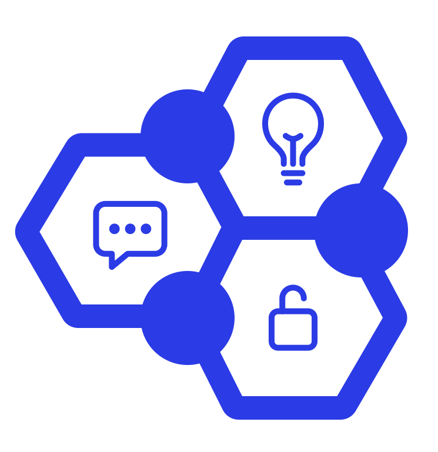
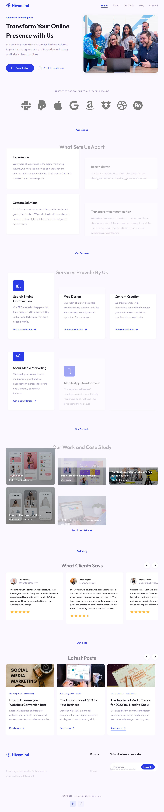

<center>

</center>

# Hivemind

## What is Hivemind ❔

In this digital age, it seems impossible a business owners don't bring their business to the online market.

Therefore, Hivemind is coming to help the shift to the online market easier by providing services that are fit for thier business.

## Technology Used ⚙️

[](https://www.typescriptlang.org/docs/)
[](https://nextjs.org)
[](https://tailwindcss.com/)
[](https://www.framer.com/motion/)
[](https://jestjs.io/)

## Setup 🔧

**IMPORTANT**: please set up the backend first in order for this to work properly. You can see it on [server-hivemind repo](https://github.com/kadekdarmayasa/server-hivemind).

If are all set. Then you are good to go ⬇️

1. Clone the repository

```
  git clone https://github.com/kadekdarmayasa/hivemind.git
```

2. Enter to the folder

```
  cd hivemind
```

3. Install dependencies

```
  npm install
```

4. Create new `.env` file in the root directory, with this value.

```
  NEXT_PUBLIC_API_URL="http://localhost:8000/api/v1"
```

**NOTE**: Make sure the port is same with the server port. In this case `server-hivemind`'s port is `8000`

5. Start Development Server

```
  npm run dev
```

## Screenshots 📸

- Homepage Dekstop Version



- Homepage Mobile Version


## LET'S CONNECT AND DISCUSS YOUR NEXT PROJECT 🗨️

[](https://linkedin.com/in/kadekdarmayasa)
[](mailto:darmayasadiputra@gmail.com)
